# Awesome Public Meeting Management 🏛️📋

   

## 🌟 Top Public Meeting Management Platforms & Governance Ecosystem

> **Curated List of Enterprise SaaS Products & Open-Source GitHub Projects**
> 
> *Focused on Agenda Management, Board Packets, Meeting Minutes, Public Transparency Portals, Video Streaming & Governance Workflows for Local Governments, School Boards, and Public Sector Agencies.*

**Last updated:** September 2026

---

This repository tracks notable **SaaS platforms** and **open-source projects** designed for **Public Meeting Management**, **Civic Tech Governance**, and **Board Portal Workflows**. These specialized software systems empower city clerks, school district secretaries, county boards, and public organizations to streamline agenda preparation, publish automated board packets, record live minutes, manage voting/approvals, and maintain ADA-compliant public transparency portals.

---

## 📌 Table of Contents
- [📊 Market Overview & Industry Structure](#-market-overview--industry-structure)
- [🏢 SaaS & Commercial Platforms](#-saas--commercial-platforms)
- [💻 Open-Source GitHub Projects](#-open-source-github-projects)
- [🤝 How to Contribute](#-how-to-contribute)
- [💖 Support & Sponsorship](#-support--sponsorship)
- [⚠️ Disclaimer](#%EF%B8%8F-disclaimer)
- [📈 Star History](#-star-history)

---

## 📊 Market Overview & Industry Structure

> 💡 **Market Size & Dynamics:** The global Public Sector Governance & Meeting Management Software market is estimated at **~$1.8 Billion - $2.4 Billion (2026)** with a compound annual growth rate (CAGR) of **~11.5%**, driven by legislative mandates for transparency, digital accessibility (ADA Section 508), and hybrid government operations.
> 
> x9c **Market Fragmentation:** The sector is **moderately concentrated** at the top tier (dominated by consolidated GovTech suites like Granicus, CivicPlus, and Diligent), while remaining **moderately fragmented** across regional school boards, smaller municipalities, and niche governance providers.

---

## 🏢 SaaS & Commercial Platforms

Commercial platforms dominate the public sector due to statutory compliance requirements, ADA accessibility rules, live video indexing, and formal clerk workflows.

*Note: Companies are sorted in descending order by scale (estimated enterprise valuation / annual revenue).*

| Company / Product | Annual Revenue / Valuation (Est.) | Pricing (Starting Tier) | Free Tier / Trial Limits | Key Features & Focus |
| :--- | :--- | :--- | :--- | :--- |
| **[Granicus](https://granicus.com/)** | ~$500M Revenue / $3.0B Valuation | $10,000 / year (Gov pay tier) | No free tier; 14-day enterprise demo on request | End-to-end GovTech suite, video streaming, agenda management, public portal, legislative workflow. |
| **[Diligent Community](https://www.diligent.com/)** | ~$600M Revenue / $4.0B Valuation | $9,600 / year (Community tier) | No free tier; custom demo sandbox available | Modern board management, public document sharing, ADA compliance, packet distribution. |
| **[CivicClerk](https://www.civicplus.com/)** (CivicPlus) | ~$150M Revenue / $1.0B Valuation | $6,000 / year (Base municipality) | No free tier; 30-day guided trial for municipal clerks | Specialized agenda and meeting workflow automation for municipal and local government. |
| **[BoardDocs](https://www.boarddocs.com/)** (Diligent) | ~$80M Revenue (Division) | $3,000 / year (Paperless Pro) | No free tier; web demonstration on request | Market leader for K-12 school boards and community colleges; agenda & policy management. |
| **[OnBoard](https://www.onboardmeetings.com/)** | ~$50M Revenue | $4,800 / year (Essential tier) | No free tier; 14-day full feature free trial | Enterprise board portal used by higher education, non-profits, healthcare, and public agencies. |
| **[PrimeGov](https://www.primegov.com/)** (Rock Solid) | ~$25M Revenue | $7,500 / year | No free tier; live product walkthrough | Integrated agenda, minute management, and public portal for local government councils. |
| **[iCompass](https://www.icompasstech.com/)** (CivicPlus) | ~$20M Revenue | $4,500 / year (Small District) | No free tier; 14-day clerk trial | Purpose-built agenda management for small-to-midsize local government entities. |
| **[BoardPAC](https://www.boardpac.com/)** | ~$15M Revenue | $3,600 / year | No free tier; 14-day interactive trial | Secure paperless board meeting automation with cross-platform mobile packet access. |
| **[Novus Agenda](https://www.novusagenda.com/)** | ~$10M Revenue | $3,500 / year | No free tier; scheduled online trial | Structured item approval workflows, automated agenda creation, and board packet assembly. |
| **[MinuteTraq](https://www.minutetraq.com/)** (eScribe) | ~$8M Revenue | $2,500 / year | No free tier; 14-day trial available | Streamlined minute taking, action item tracking, and legislative records management. |

---

## 💻 Open-Source GitHub Projects

Open-source meeting tools provide collaborative minute-taking, self-hosted board portals, and transparency publishing capabilities.

*Note: Repositories are sorted in descending order by GitHub Star count.*

- **[Decidim](https://github.com/decidim/decidim)**   
  Free, open-source participatory democracy framework for cities and organizations. Supports public proposals, meeting management, assemblies, and decision-making workflows.

- **[4Minitz](https://github.com/4minitz/4minitz)**   
  Free and open-source web application for collaborative meeting minutes. Supports agenda preparation, live minute-taking, action item tracking, and self-hosting.

- **[OpenSlides](https://github.com/OpenSlides/OpenSlides)**   
  Digital assembly and meeting management system for handling agendas, motions, list of speakers, voting, and real-time presentation.

- **[Meeting-Stream](https://github.com/meeting-stream/meeting-stream)**   
  Open-source meeting recorder and agenda indexing engine for public and municipal live streams.

- **[GovDirectory](https://github.com/govdirectory/govdirectory)**   
  Crowdsourced, open data directory of public agencies and official bodies, supporting public meeting metadata and governance integration.

- **[Meeting-Minutes-App](https://github.com/meeting-minutes/meeting-minutes)**   
  Lightweight self-hosted tool for capturing public agendas, roll calls, and publishing meeting summary reports.

---

## 🤝 How to Contribute

1. Fork the repository 🍴
2. Create a feature branch (`git checkout -b feature/new-meeting-tool`)
3. Add/edit entries in `README.md` (follow standard table/list formats)
4. Submit a Pull Request 🚀

---

## 💖 Support & Sponsorship

If you find this curated list helpful for your municipality, school district, or civic-tech project, please consider supporting the project:

- ⭐ **Star** this repository to increase visibility
- 🔀 **Fork** and contribute new tools or updates
- 📢 **Share** with city clerks, governance professionals, and civic hackers
- ☕ **Buy me a coffee / Sponsor:** [GitHub Sponsor Dashboard](https://github.com/sponsors/ishandutta2007)

---

## ⚠️ Disclaimer

- This is a **community-curated** resource — not an exhaustive registry or official endorsement.
- Public meeting systems support statutory compliance, legal record-keeping, and civic transparency. They must comply with open-meeting laws, records retention, accessibility (ADA Section 508), and privacy rules. Open-source or self-hosted solutions require careful security configuration.

---

## 📈 Star History

---

**Made with ❤️ for city clerks, school board secretaries, municipal IT teams, and civic-tech pioneers.**
